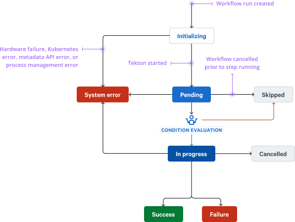

# Step execution model and outcomes (2020-02-10)

## Stakeholders

* **Recommenders:** Noah Fontes, Rick Lane
* **Agreers:** Brad Heller, Kyle Terry
* **Performers:** Rick Lane
* **Inputers:** Noah Muldavin
* **Deciders:** Brad Heller, Noah Muldavin, Kyle Terry

## Problem

We lack clarity on the possible status a step can be in when a workflow is run.
We've also conflated computational work with other processes in a way that is
seemingly both confusing to our system and to end users. The UI has strange
logic to encapsulate this, and as we look at adding additional step types and
statuses, it isn't getting any simpler.

## Summary

This change formally defines a step and the different execution statuses that a
step may take on as part of a single finite state machine. We additionally
propose to separate approvals into a distinct subsystem that is subject to
different rules that have more clarity for end users.

## Motivation

This change is relatively simple technically (updating some state fields in our
Kubernetes resources) and provides a great deal of clarity for implementers of
workflow visualization UIs and end users.

## Product-level explanation

We address the issue of different outcomes per step type (that is, container
steps having `success` and `failure` but approval steps having `accepted` and
`rejected`) by making the definition of a step more strict.

This RFC defines a **step** as a unit of computational **work**. Other
processes, such as approvals and triggers, are not steps, and shall not be
included with steps in workflows. We expect there to be multiple step types in
the future (for example, groups of steps), but they will all have a common
`success` or `failure` outcome.

### Actions

As it relates to our current implementation, we introduced the concept of step
types to support approvals, a *non-work* process. We therefore propose a new
generic structure for approvals, **queries**, that is external to, and
referential to, steps. We believe this will create a clearer user experience. A
separate RFC will address the technical implementation of queries, but we
highlight the change here because we eliminate the `approved` (expressed as
`success`) and `rejected` step statuses as part of this RFC.

Holistically, steps and queries belong to a category of atomic functionality we
refer to as **actions**.

In summary, today we have a YAML document with an approval step:

```yaml
steps:
- name: my-gate
  type: approval
- name: deploy
  dependsOn: approval
  image: projectnebula/terraform
  # ...
```

We propose to replace this with a more substantial feature:

```yaml
queries:
- name: my-gate
  image: projectnebula/query-manual-gate
  spec:
    question: !Fn.concat ['Do you want to deploy ', !Parameter project, '?']

steps:
- name: deploy
  when: !Reply my-gate
  image: projectnebula/terraform
  # ...
```

This allows customers to bring their own queries as long as they conform to our
queries API. (In this case, we use our own manual gate image, which may also be
the default.)

## Engineering-level explanation

Currently, the set of possible statuses for a step are `pending`, `in-progress`,
`success`, `failure`, `skipped`, `timed-out`, `cancelled`, and `rejected`, none
of which are rigorously defined.

We propose to amend the set of execution statuses possible for all steps to be
defined by a single FSM. In addition, we propose removing non-work steps
entirely as well as the `rejected` (see the discussion in the product-level
explanation) and `timed-out` (specialized case of `failure`) statuses.

### Resolution

This document refers to execution statuses as **resolved** or **unresolved**.
This is a concept that can be generalized to any data field that is used in a
condition. Data that is **unresolved** cannot be used to make a decision yet; it
represents a lock around the data itself with a value that indicates why the
lock is being held. Data that is **resolved** is no longer locked, and its value
is directly available for consumption. A condition will wait indefinitely for
all *necessary* unresolved data to be resolved (conditions are allowed to
short-circuit).

### Execution status



The new step statuses are:

* `initializing` (unresolved): The run resource has been created, but the
  execution backend (Tekton, metadata API) is not running yet.
* `pending` (unresolved): The execution backend started and the step is waiting
  for all of its `when`-conditions to be satisfiable (*not* satisfied) before
  running.
* `in-progress` (unresolved): If the `when`-conditions are satisfied, the step
  executes. If the particular step type does not perform any work (as is the
  case with an approval step type, for example), this status is skipped and the
  step transitions directly to completed.
* `success` (resolved): All work associated with this step completed in a way
  the step semantically deems successful.
* `failure` (resolved): Either all work associated with this step completed in a
  way the step semantically deems unsuccessful or an author-imposed policy (such
  as a timeout) prevents the step from completing.
* `system-error` (resolved): If an error occurs that causes a serious lack of
  accounting for the management of a step, the step transitions to a
  `system-error` status. This generally implies a hardware failure, Kubernetes
  error, metadata API error, or other management error that indicates a serious
  problem with executing the run. It is different from a `failure` status, which
  indicates that the work being supervised failed, not that the supervision
  itself failed. When a step enters a `system-error` status, the entire run is
  halted and is assigned a `system-error` outcome.
* `skipped` (resolved): If either the `when`-conditions are not satisfied or the
  run is cancelled prior to the step running, the step transitions to the
  `skipped` status.
* `cancelled` (resolved): If a user agent requests cancellation while a step is
  in an `in-progress` status, the underlying process is immediately interrupted
  and transitioned to this status.

These are a superset of the existing step statuses, so this serves to clarify
their current meaning as well as reduce ambiguity by adding additional statuses.

We define a new YAML tag, `!Status`, to refer to the resolved (terminal)
status of a step. For example, we may want to run a particular step to perform cleanup work if another step failed:

```yaml
when:
- !Fn.equals [!Status some-step, failure]
```

### Run state

One of the consequences of adding the ability to form conditions around resolved
statuses of steps is that the failure of a step no longer has a one-to-one
correlation to the failure of a run.

The new run statuses are:

* `initializing` (unresolved): The run resource has been created, but the
  execution backend (Tekton, metadata API) is not running yet.
* `in-progress` (unresolved): The run is executing.
* `complete` (resolved): All actions associated with this run reached a resolved
  status.

Additionally, we express the **outcome** of a run independently of its status:

* `success`: All actions associated with this run reached a resolved status
  without an instruction to the run to assign any other outcome. Note that this
  does not necessarily mean that each action succeeded.
* `failure`: One or more actions implicitly or explicitly informed this run that
  it cannot be considered successful.
* `system-error`: One or more system errors occurred (see above, as the same
  logic applies for steps) when executing the run.
* `cancelled`: A user agent requested cancellation of the run.

We discuss step failure below; however, the other resolved statuses of steps impact the run in the following ways:

* `success`: No impact.
* `system-error`: The run is immediately cancelled and assigned the outcome
  `system-error`.
* `skipped`: No impact.
* `cancelled`: No impact (because cancellation can only be initiated from a
  run).

#### Implications of step failure

*Note:* Queries have different implications for run state than steps. Queries
are designed either to provide output data as replies or to fail in a way that
cannot be reconciled. A failure of a query to provide its replies causes a
terminal failure of a run.

Generally, if a step fails, we assign the run the outcome `failure`. This does
not affect the execution of other steps except to the extent that they reference
the failing step's status.

*Note:* We leave open the possibility to add customizable behavior upon outcome
assignment, including immediate termination of the run and skipping any pending
steps. These future behaviors are outside the scope of this RFC.

Authors will expect sensible implicit behavior when referencing a step's status
in a condition. In particular, when a step's execution is conditioned on the
failure of another step, run outcome should be *unaffected* by the dependency's
failure. A run's outcome is not assigned `failure` if the following statements
are true when a step fails:

1. A direct dependent of the step specifically references its status using
   `!Status` in a condition.
2. The nearest predicate to the status reference, including transitive
   evaluation of unary not operations, evalutes to `true`.

As an example, this implicit behavior applies if an author uses the following
`when` conditions:

```yaml
when: !Fn.equals [!Status step-a, failure]
---
when: !Fn.notEquals [!Status step-a, success]
```

We concede that this implicit behavior may not be sufficient for all use cases,
so we introduce a new marker for steps, **failure mode**, to which we ascribe
two possible values, `auto` or `ignore`. The default `auto` value provides the
implicit behavior described above. The `ignore` value causes the failure of the
step to never cause the run to fail. Of course, dependent steps that are
conditioned on a success status will be transitioned to `skipped`.

From an authoring perspective, we group this under an umbrella term of
step-specific **policies**, which in the future may include instructions for
retrying the step, execution time limits, and other administrative rules.

For example:

```yaml
steps:
- name: never-fails
  image: alpine
  input:
  - exit 1
  policies:
    failureMode: ignore
```

We may want to add a `collect` failure mode that aggregates errors and
eventually causes a run to have a `failure` status, but allows other steps in
the workflow to continue executing. We leave this consideration for a future
RFC.

### API model

We propose an update to the API to propagate this information to users. We amend
the `status` property of the `AnyWorkflowRunStepState` schema:

```yaml
AnyWorkflowRunStepState:
  type: object
  properties:
    status:
      type: string
      description: Execution status of this step
      enum:
      - initializing
      - pending
      - in-progress
      - success
      - failure
      - system-error
      - skipped
      - cancelled
      example: pending
    # ...
```

We propose to amend the `WorkflowRunStateSummary` schema as follows:

```yaml
WorkflowRunStateSummary:
  type: object
  properties:
    status:
      type: string
      description: Current status of the run
      enum:
      - initializing
      - in-progress
      - complete
    outcome:
      type: string
      description: The outcome of the run
      enum:
      - success
      - failure
      - system-error
      - cancelled
    # ...
```

The `outcome` property will not be present until an outcome is assigned.

### Additional considerations

Note that we do not reference `dependsOn` when describing the state transition
from `pending` to `in-progress`. `dependsOn` is now defined as equivalent to a
particular `when`-condition, namely:

```yaml
dependsOn: step-a
```

⥴

```yaml
when: !Fn.equals [!Status step-a, success]
```
